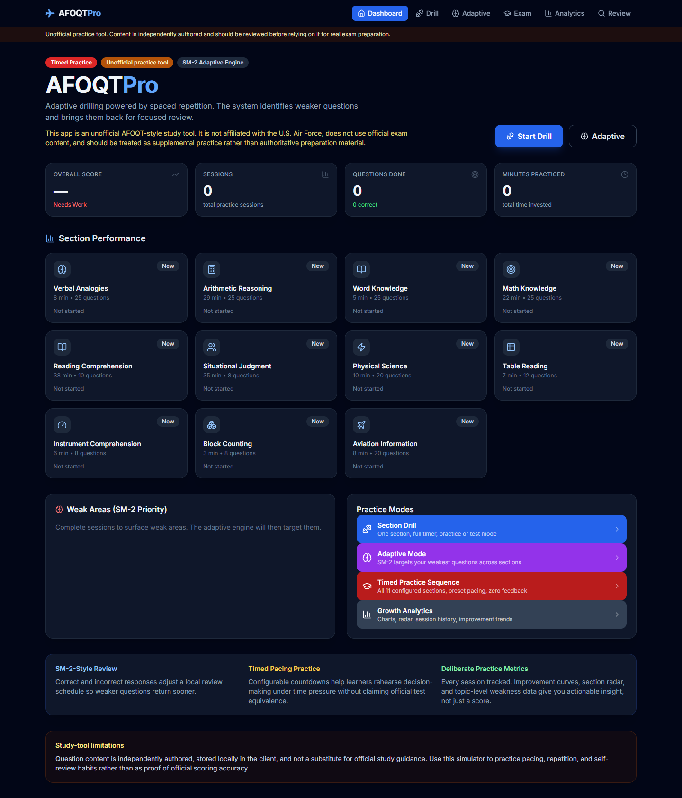
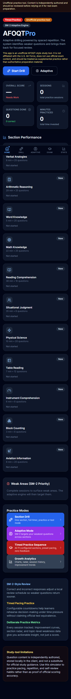
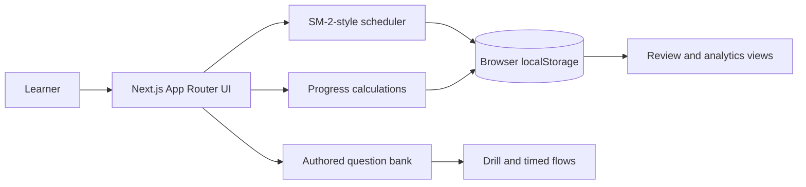

# AFOQTPro

Unofficial, local-first AFOQT-style learning simulator with timed practice,
SM-2-style review scheduling, and progress analytics.

[Live demo](https://afoqt-simulator.vercel.app) ·
[Architecture](docs/ARCHITECTURE.md) ·
[Security](SECURITY.md) ·
[Limitations](#scope-and-limitations)



## 30-second engineering overview

- 186 independently authored questions across 11 configurable practice sections
- drill, timed sequence, adaptive review, answer review, and analytics workflows
- local-first persistence with malformed/legacy-state recovery
- deterministic SM-2-style scheduling and transparent practice-group summaries
- installable PWA shell with responsive desktop/mobile navigation
- zero-warning lint, type checking, production build, dependency audit, CodeQL,
  and current/history privacy gates in CI

This project demonstrates product engineering and learning-system design. It is
not an official test product and does not claim score, percentile, eligibility,
or test-day equivalence.

## Product evidence

| Workflow | Evidence in the repository |
|---|---|
| Section practice | configured pacing, practice/test feedback modes, saved attempts |
| Adaptive review | deterministic SM-2-style interval updates and weak-question queue |
| Timed sequence | 11 authored sections, countdowns, no-feedback run, section summary |
| Progress analytics | section trends, weak-topic analysis, practice-group averages |
| Local-first resilience | guarded JSON parsing, normalized defaults, no account data |
| Delivery | PWA manifest/service worker, CI, CodeQL, safety scanner, Vercel demo |

<p align="center">
  
</p>

## Architecture



The deployed application is static and client-side. No account, server API,
database, advertising tracker, or analytics SDK receives learner progress.
See [the architecture record](docs/ARCHITECTURE.md) for boundaries and decisions.

## Tech stack

- Next.js 16.3 and React 19.2
- TypeScript 6, Tailwind CSS 3, Radix UI, Framer Motion, Recharts
- Node test runner, ESLint, GitHub Actions, CodeQL, Dependabot
- Vercel static deployment and installable PWA assets

## Reproduce the quality gates

```bash
npm ci
npm run safety:self-test
npm run safety:current
npm run safety:history
npm test
npm run lint
npm run typecheck
npm run build
npm audit --audit-level=high
```

Run `npm run dev` and open [http://localhost:3000](http://localhost:3000) for
local product review. Node 24 or newer is required by this repository.

## Technical decisions

- **Local-first by design:** progress remains in the learner's browser and the
  app works without account infrastructure.
- **Transparent practice metrics:** section percentages and group averages are
  labeled as local practice summaries, never official composites.
- **Educational honesty:** the product separates controlled AFOQT facts from
  independently authored questions and configured pacing presets.
- **History-aware privacy:** releases scan both tracked content and all reachable
  Git blobs while keeping internal agent/spec artifacts out of the public tree.
- **Compatibility over novelty:** the local-state key remains stable and invalid
  state is normalized instead of breaking returning users.

## Scope and limitations

- This project is not affiliated with or endorsed by the U.S. Air Force.
- It contains no official or licensed test questions.
- The 186-question bank is independently authored and not an exhaustive or
  certified study source.
- Timers and reference counts are practice presets, not guaranteed current
  test specifications.
- Practice-group averages are not official composites, percentiles, minimums,
  eligibility decisions, or predictors.
- Progress is stored only in the current browser; there is no account sync or
  cloud backup.
- Learners should confirm current structure, rules, accommodations, and scoring
  with an authorized recruiter or test administrator.

## Authoritative context used for framing

The January 2025 Department of the Air Force testing manual describes the AFOQT
as 12 subtests used to compute five aptitude composites, reported as percentiles
from 1 to 99, with about 4.75 hours allowed for administration. The official
practice pamphlet explicitly describes itself as familiarization material rather
than a complete study system. Those sources inform the disclaimers; their
controlled questions and scoring are not reproduced here.

- [DAFMAN 36-2664, Attachment 2](https://static.e-publishing.af.mil/production/1/af_a1/publication/dafman36-2664/dafman36-2664.pdf)
- [U.S. Air Force AFOQT practice pamphlet](https://www.airforce.com/content/dam/airforce/en/pdf/AFOQT_PracticePamphlet.pdf)

## Repository policy

Use [GitHub private vulnerability reporting](../../security/advisories/new) for
security concerns. Contributions must preserve the unofficial framing, synthetic
public evidence, and all required quality gates. See [CONTRIBUTING.md](CONTRIBUTING.md).

Released under the [MIT License](LICENSE).
